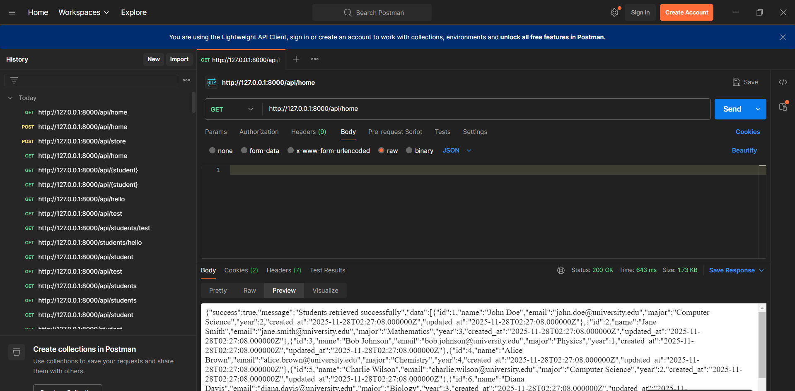

# Laravel Student API & Docker
### Faiza Tasnim
**Course:** Software Quality
**Project:** Student Management System

---
# What is a REST API?

A **REST API** allows different computer systems to communicate using HTTP methods such as **GET**, **POST**, **PUT**, and **DELETE**.

---
## Key Concepts

### Client and Server
- Client sends request (browser, frontend app).
- Server processes request and returns JSON response.

### Stateless Communication
- Each request contains all necessary info.
- Server does not store session info.

---
### Resources
- Everything is a **resource** (user, student, etc.).

---
## My Project: Student Management System
- Demonstrates CRUD operations for students.
- Uses Laravel REST API with **Sanctum Bearer Token** authentication.
- Tested with Postman, cURL.

---
## API Security: Bearer Token
- Include token in request header:
```
Authorization: Bearer <your_token_here>
```

---
## Laravel APIs Overview
- Admin and Student CRUD endpoints
- Token-protected routes
- Example endpoints and responses in the following slides

---
## Example: Get All Students
**Endpoint:** GET `/api/home`

**cURL:**
```bash
curl -H "Authorization: Bearer <token>" http://localhost:8000/api/home
```

**Response:**
```json
[
  {"id":1,"name":"John Doe","email":"john@example.com","major":"CS","year":3},
  {"id":2,"name":"Jane Smith","email":"jane@example.com","major":"IT","year":2}
]
```

---
Here is a example of working api:


---
## Example: Create Student
**Endpoint:** POST `/api/store`

**cURL:**
```bash
curl -X POST -H "Authorization: Bearer <token>" -H "Content-Type: application/json" \
-d '{"name":"Alice","email":"alice@example.com","major":"CS","year":1}' \
http://localhost:8000/api/store
```

**Response:**
```json
{
  "success":true,
  "message":"Student created successfully",
  "data":{"id":3,"name":"Alice","email":"alice@example.com","major":"CS","year":1}
}
```

---
Here is a example of working api with bearer token:


---
## Example: Update Student
**Endpoint:** PUT `/api/students/{id}`

**cURL:**
```bash
curl -X PUT -H "Authorization: Bearer <token>" -H "Content-Type: application/json" \
-d '{"major":"AI","year":2}' http://localhost:8000/api/students/3
```

**Response:**
```json
{
  "success":true,
  "message":"Student updated successfully",
  "data":{"id":3,"name":"Alice","email":"alice@example.com","major":"AI","year":2}
}
```

---
## Example: Delete Student
**Endpoint:** DELETE `/api/students/{id}`

**cURL:**
```bash
curl -X DELETE -H "Authorization: Bearer <token>" http://localhost:8000/api/students/3
```

**Response:**
```json
{
  "success":true,
  "message":"Student deleted successfully"
}
```

---
## Docker Containerization
- Laravel app container
- MySQL database container
- Docker Compose for orchestration
- Single command deployment using `run.sh`

---
## Docker Compose Example
```yaml
services:
  app:
    build: .
    ports:
      - "8000:8000"
    depends_on:
      - db

  db:
    image: mysql:8.0
    environment:
      MYSQL_ROOT_PASSWORD: root
      MYSQL_DATABASE: student_api
```

---
## One-Command Deployment Script
**run.sh:**
```bash
#!/bin/bash

docker-compose up -d --build
php artisan migrate --seed
php artisan serve --host=0.0.0.0 --port=8000
```

---
## API Testing Tools
- Postman for testing CRUD
- cURL for command line testing

---
## Conclusion
- Laravel Student API implemented with Sanctum authentication
- Containerized with Docker 